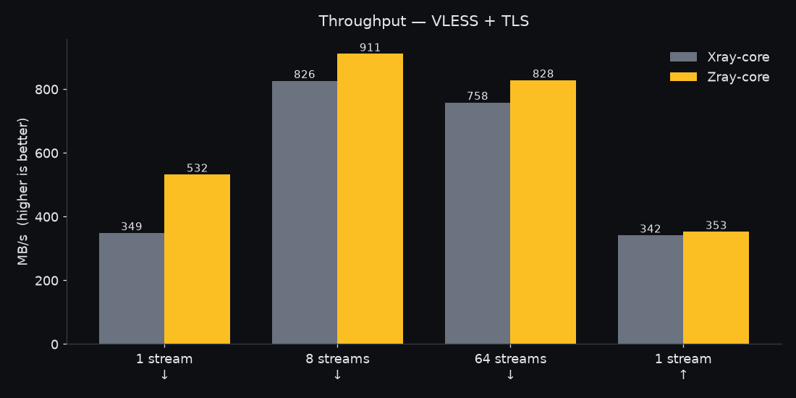
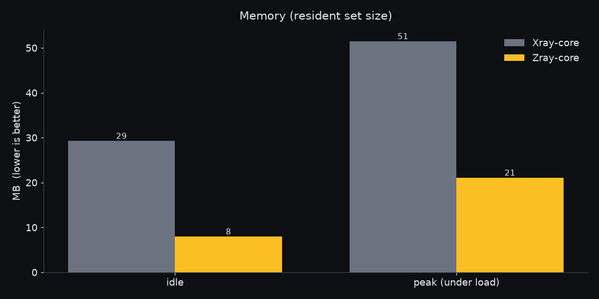
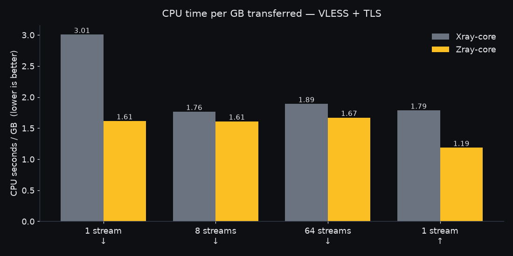
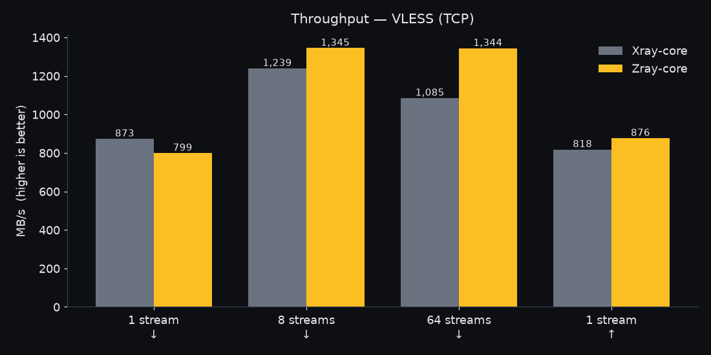

<div align="center">


# ZeroNet

### Performance, Speed, and Freedom in your hands.
### کارایی، سرعت و آزادی در دستان شما.

<a href="https://github.com/zeghostwriter/ZeroNet/releases/latest"><b>⬇️ دانلود آخرین نسخه</b></a><br>
<a href="https://github.com/zeghostwriter/ZeroNet/releases/latest"><b>⬇️ Download the latest release</b></a>

[فارسی](#فارسی) · [English](#english)

</div>

---

<div dir="rtl">

## فارسی

**زیرونت** یک VPN ساده و سریع برای عبور از فیلترینگ است. برای ویندوز، لینوکس، مک و اندروید. قلب آن **Zray** است، یک هسته‌ی شبکه که از صفر با زبان **Rust** نوشته شده. کانفیگ‌هایی که امروز با Xray کار می‌کنند (VLESS،&rlm; REALITY،&rlm; Vision،&rlm; XHTTP،&rlm; VMess،&rlm; Trojan،&rlm; Shadowsocks و…) در زیرونت هم کار می‌کنند.

### ⚡ چرا این‌قدر سریع است؟

زبان Rust به کد ماشین کامپایل می‌شود و Garbage Collector ندارد. پس برنامه هیچ‌وقت برای «جمع‌کردن حافظه» مکث نمی‌کند و فقط همان حافظه‌ای را می‌گیرد که واقعاً لازم دارد. نتیجه: اینترنت سریع‌تر، مصرف کمتر رم و CPU، و باتری ماندگارتر، حتی روی سیستم‌ها و گوشی‌های ضعیف.

ما Zray و Xray-core را روی یک سیستم، با یک سرور و یک کانفیگ مقایسه کردیم. تنها چیزی که عوض شد هسته‌ی کلاینت بود:

| | Xray-core | **Zray (زیرونت)** |
|---|---:|---:|
| سرعت دانلود با TLS (یک اتصال) | ۳۴۹ مگابایت بر ثانیه | **۵۳۲ مگابایت بر ثانیه** (۵۳٪ سریع‌تر) |
| مصرف CPU برای هر گیگابایت (TLS) | ۳٫۰ ثانیه | **۱٫۶ ثانیه** (۴۶٪ کمتر) |
| رم در حالت بیکار | ۲۹ مگابایت | **۸ مگابایت** (۳٫۷ برابر کمتر) |
| بیشترین مصرف رم زیر بار | ۵۱ مگابایت | **۲۱ مگابایت** (۲٫۴ برابر کمتر) |

</div>

<!-- These four charts are the 2026-04 measurement, not a current run. The
     harness that drew them did not validate the payload, timed the transfer
     window including connection setup, measured no ceiling for its own load
     generator and held the core order fixed. They are kept so the table above
     stays backed by the file that produced it. Current runs publish their own
     charts, in CI, at docs/benchmarks/. -->
<p align="center">
  
  
  
  
</p>

<div dir="rtl">

در همه‌ی تست‌ها، Zray مصرف CPU کمتری داشت. تنها موردی که Xray جلو بود، دانلود تک‌اتصالی بدون TLS بود (۸۷۳ در برابر ۷۹۹ مگابایت بر ثانیه). نمودارها بالا هستند.

> **این اعداد از کجا آمده‌اند.** جدول و نمودارها در آوریل ۲۰۲۶ روی یک Xeon چهار هسته‌ای اندازه‌گیری شدند: یک پروتکل، دو لایه‌ی امنیتی، و یک رقیب. روش و اعداد خام در [`docs/benchmarks/results/2026-04-legacy/`](docs/benchmarks/results/2026-04-legacy/) است.
>
> ابزار اندازه‌گیری بعداً عوض شد: حالا داده را اعتبارسنجی می‌کند، پنجره‌ی انتقال را از برقراری اتصال جدا می‌کند، سقف سرعت خودش را اندازه می‌گیرد و منتشر می‌کند، ترتیب هسته‌ها را می‌چرخاند، کنار هر مقایسه پراکندگی خودِ هسته‌ی مرجع را نشان می‌دهد، و sing-box و xray-rust را هم اضافه می‌کند. روی GitHub Actions و روی سخت‌افزار ثبت‌شده اجرا می‌شود، و هر خانه‌ای که یک هسته پشتیبانی نمی‌کند خالی می‌ماند همراه با دلیلش — حذف نمی‌شود. جزئیات: [`docs/benchmarks`](docs/benchmarks) و [`protocol-support.md`](docs/benchmarks/protocol-support.md).

### 📥 نصب (فقط چند کلیک)

همه‌ی فایل‌ها در صفحه‌ی **[Releases](https://github.com/zeghostwriter/ZeroNet/releases/latest)** هستند:

| سیستم | فایل | چه کار کنم؟ |
|---|---|---|
| 🪟 ویندوز | `ZeroNet-Windows-x64.zip` | فایل را از حالت فشرده خارج کنید و روی `ZeroNet.exe` دوبار کلیک کنید. اگر ویندوز هشدار داد: **More info ←&rlm; Run anyway**. |
| 🐧 لینوکس (بیشتر کامپیوترها: اینتل و AMD) | `ZeroNet-Linux-x64.AppImage` | راست‌کلیک ← Properties ← تیک **Allow executing file as program**. بعد دوبار کلیک کنید. برنامه خودش در ترمینال باز می‌شود. |
| 🐧 لینوکس روی ARM (رزبری‌پای، لپ‌تاپ‌های ARM) | `ZeroNet-Linux-ARM64.AppImage` | مثل بالا. |
| 🍎 مک | `ZeroNet-macOS-universal.zip` | از حالت فشرده خارج کنید، `ZeroNet.app` را به Applications ببرید. بار اول **راست‌کلیک ← Open** (برنامه امضای اپل ندارد). |
| 🤖 اندروید | `ZeroNet-Android-universal.apk` | نصب کنید. اگر پرسید، اجازه‌ی نصب از منابع ناشناس را بدهید. |

> مطمئن نیستید کدام فایل لینوکس؟ در ترمینال `uname -m` را بزنید: `x86_64` یعنی **x64** و `aarch64` یعنی **ARM64**. خطای «exec format error» یعنی فایل آن یکی را لازم دارید.
>
> برای گوشی‌های جدید فایل `arm64-v8a` کم‌حجم‌تر است. اگر مطمئن نیستید، `universal` را بگیرید.

**Zray Core** همان موتور بدون برنامه است: یک برنامه‌ی خط فرمان برای سرور، روتر و اسکریپت. در همان صفحه است با نام‌های `ZrayCore-Windows-x64.zip`،&rlm; `ZrayCore-Linux-x64.tar.gz`،&rlm; `ZrayCore-Linux-ARM64.tar.gz` و `ZrayCore-macOS-universal.tar.gz`. فایل را باز کنید و `zray run config.json` را بزنید (`zray help` بقیه‌ی دستورها را نشان می‌دهد).

### 🧭 استفاده

1. لینک کانفیگ (`vless://`،&rlm; `vmess://`،&rlm; `trojan://`،&rlm; `ss://` یا لینک ساب‌اسکریپشن) را کپی کنید و در زیرونت **Ctrl+V** بزنید.
2. روی دکمه‌ی اتصال کلیک کنید. همه‌چیز با موس کار می‌کند، مثل یک برنامه‌ی معمولی.
3. در تنظیمات، **System Proxy** را روی **SET SYSTEM** بگذارید (یا آن‌قدر **Ctrl+P** بزنید تا SET SYSTEM شود) تا بقیه‌ی برنامه‌ها هم از آن استفاده کنند.

**اکانت رایگان WARP:** توی زیرونت کلید **W** را بزنید تا یک اکانت WARP از کلودفلر بگیرید. کلیدها روی دستگاه خودتان ساخته می‌شوند و فقط نیمه‌ی عمومی‌شان فرستاده می‌شود. هر سه راه (WireGuard و MASQUE روی HTTP/2 و روی HTTP/3) را با هم امتحان می‌کند و اولی را نگه می‌دارد که واقعاً ترافیک رد کند، و یادش می‌ماند کدام روی شبکه‌ی شما کار کرد. اگر API کلودفلر جایی که هستید فیلتر است، اول به یک سرور وصل شوید و دوباره **W** را بزنید.

**سه حالت اتصال** (روی صفحه‌ی اصلی اپ اندروید):
- **معمولی:** فقط سرورهای رمزگذاری‌شده (TLS یا REALITY) که مثل HTTPS معمولی دیده می‌شوند، همراه چند سرور پشتیبان. بهترین انتخاب برای استفاده‌ی روزمره.
- **سریع:** به اولین سروری که کار کند وصل می‌شود، بدون جست‌وجوی اضافه. سریع‌ترین راه برای وصل شدن.
- **گیمینگ:** کمترین پینگ، UDP روشن (برای بازی‌ها و تماس صوتی)، بدون سرورهای پشت CDN، و سرور وسط بازی عوض نمی‌شود. سایت‌ها و سرورهای بازی ایرانی مستقیم می‌روند.

**برنامه‌های دیگر:**
- **تلگرام:** Settings ←&rlm; Advanced ←&rlm; Connection type ←&rlm; **Use system proxy**. در لینوکس بعد از روشن‌کردن پروکسی، تلگرام را کامل ببندید و دوباره باز کنید.
- **فایرفاکس:** Settings ←&rlm; Network Settings ←&rlm; **Use system proxy settings**.

**حالت TUN** (همه‌ی برنامه‌ها بدون تنظیم جداگانه): در لینوکس و مک زیرونت رمز سیستم را می‌پرسد. در ویندوز برنامه را با **Run as administrator** باز کنید (فایل `wintun.dll` کنار برنامه است).

### 🛠️ ساخت از سورس

</div>

```sh
cargo run --release -p zeronet-tui        # desktop app
cd ZeroNet-Mobile && ./gradlew assembleRelease   # Android (see ZeroNet-Mobile/README.md)
```

---

## English

**ZeroNet** is a fast, simple VPN for getting past censorship, on Windows,
Linux, macOS and Android. Its heart is **Zray**, a networking core written
from scratch in **Rust**. It speaks the same configs as Xray: VLESS, REALITY,
Vision, XHTTP, VMess, Trojan, Shadowsocks and more. A config that works in
Xray works here.

### ⚡ Why it's fast

Rust compiles to native code and has no garbage collector. The core never
pauses to clean up memory and only holds the memory it actually uses. That
means more speed, less RAM and CPU, and longer battery life, even on old
laptops and cheap phones.

We ran Zray and Xray-core on the same machine, against the same server,
from the same config file. Only the client core changed:

| | Xray-core | **Zray (ZeroNet)** |
|---|---:|---:|
| Download over TLS, 1 connection | 349 MB/s | **532 MB/s** (+53%) |
| CPU time per GB over TLS | 3.0 s | **1.6 s** (−46%) |
| Memory at idle | 29 MB | **8 MB** (3.7× less) |
| Peak memory under load | 51 MB | **21 MB** (2.4× less) |

Zray used less CPU per gigabyte in every test. Xray was faster in one case:
a single plain-TCP download (873 vs 799 MB/s). The charts are above.

> **Where these numbers come from, and what has replaced them.** The table and
> the charts were measured in April 2026 on a 4-vCPU Xeon, with one protocol at
> two security layers against one comparator. The method and the raw numbers are
> in [`docs/benchmarks/results/2026-04-legacy/`](docs/benchmarks/results/2026-04-legacy/).
>
> The harness has since been replaced by one that validates the payload,
> separates the transfer window from connection setup, measures and publishes its
> own ceiling, rotates and reverses the core order, prints every comparison next
> to the baseline's own run-to-run spread, and adds sing-box and xray-rust. It
> runs in GitHub Actions on a recorded runner, and every cell that a core cannot
> be configured for is shown as empty with the reason rather than left out.
> See [`docs/benchmarks`](docs/benchmarks) and
> [`docs/benchmarks/protocol-support.md`](docs/benchmarks/protocol-support.md).
> The numbers above are kept as they were published; they are not comparable with
> the current runs, and re-measuring them on the new harness is the next thing
> this table needs.

### 📥 Install

Everything is on the **[Releases page](https://github.com/zeghostwriter/ZeroNet/releases/latest)**:

| Platform | File | What to do |
|---|---|---|
| 🪟 Windows | `ZeroNet-Windows-x64.zip` | Extract it and double-click `ZeroNet.exe`. If SmartScreen appears: **More info → Run anyway**. |
| 🐧 Linux, most computers (Intel / AMD) | `ZeroNet-Linux-x64.AppImage` | Right-click → Properties → **Allow executing file as program**, then double-click. It opens in a terminal window on its own. (A plain `.tar.gz` is there too.) |
| 🐧 Linux on ARM (Raspberry Pi, ARM laptops) | `ZeroNet-Linux-ARM64.AppImage` | The same. |
| 🍎 macOS | `ZeroNet-macOS-universal.zip` | Unzip and move `ZeroNet.app` to Applications. The first time, **right-click → Open**: the app isn't notarized by Apple. If macOS says it is damaged, run `xattr -dr com.apple.quarantine /Applications/ZeroNet.app`. |
| 🤖 Android | `ZeroNet-Android-universal.apk` | Install it and allow installs from this source if asked. `arm64-v8a` is a smaller download for most modern phones. |

Not sure which Linux file? Run `uname -m` in a terminal: `x86_64` means
**x64**, `aarch64` means **ARM64**. "exec format error" means you have the
other one.

**Zray Core** is the same engine without the app: one command-line program
for servers, routers and scripts. It is on the same page, as
`ZrayCore-Windows-x64.zip`, `ZrayCore-Linux-x64.tar.gz`,
`ZrayCore-Linux-ARM64.tar.gz` and `ZrayCore-macOS-universal.tar.gz`. Unpack
it and run `zray run config.json` (`zray help` lists the rest).

ZeroNet is a terminal app that works like a desktop app: mouse, hover,
menus, clicks. When you double-click it, it opens its own terminal window.
On macOS it runs in Terminal.app, so double-clicking always works.

### 🧭 Using it

1. Copy a config link (`vless://`, `vmess://`, `trojan://`, `ss://`, or a
   subscription URL) and press **Ctrl+V** in ZeroNet.
2. Click connect.
3. In Settings, set **System Proxy** to **SET SYSTEM** (or press **Ctrl+P**
   until it shows SET SYSTEM) so other apps use it too.

**Free WARP account:** press **W** in ZeroNet to get a Cloudflare WARP account. The keys are made on your device and only the public halves are sent. It tries all three ways (WireGuard, MASQUE over HTTP/2 and over HTTP/3) at once and keeps the first one that really carries traffic, and remembers which one worked on your network. If Cloudflare's API is filtered where you are, connect to a server first and press **W** again.

**Three connection modes** (on the Android home screen):
- **Normal:** encrypted servers only (TLS or REALITY, which look like ordinary HTTPS), with backups ready. The everyday choice.
- **Fast:** connects to the first server that works, nothing more. The quickest way to get online.
- **Gaming:** lowest ping, UDP allowed (games and voice need it), no CDN-fronted servers, and the server is never switched mid-match. Iranian sites and game servers still go direct.

**Other apps:**
- **Telegram:** Settings → Advanced → Connection type → **Use system proxy**.
  On Linux, Telegram reads the proxy only when it starts, so fully quit it
  and open it again after turning the proxy on.
- **Firefox:** Settings → Network Settings → **Use system proxy settings**.
- **TUN mode** covers every app without configuring anything. On Linux and
  macOS, ZeroNet asks for your password. On Windows, start it with **Run as
  administrator**; the `wintun.dll` it needs ships in the zip.

### 🛠️ Build from source

```sh
cargo run --release -p zeronet-tui              # desktop app
cd ZeroNet-Mobile && ./gradlew assembleRelease  # Android, see ZeroNet-Mobile/README.md
```

Maintainers: pushing a tag like `v0.2.0` builds every download and publishes
the release (`.github/workflows/release.yml`).

### Repository layout

| Path | What it is |
|---|---|
| `crates/` | **Zray-core**, the Rust workspace: protocols, transports, DNS, routing, evasion, discovery, TUN, and the mobile FFI (`zray-mobile`). |
| `crates/zeronet-tui/` | The ZeroNet desktop app. |
| `ZeroNet-Mobile/` | The Android app (Kotlin/Compose), which loads the core as a native library. |
| `packaging/` | Icons and desktop metadata used by the release builds. |
| `docs/` | Benchmarks, protocol specs, and design notes. |
| `deploy/` | The optional Cloudflare Worker edge. |
| `fuzz/` | Fuzz targets for the parsers. |

### License

MIT, for the core, the desktop client and the Android app (see `LICENSE`).
Third-party components keep their own licences; the app's notices are under
`ZeroNet-Mobile/app/src/main/assets/licenses/`.
